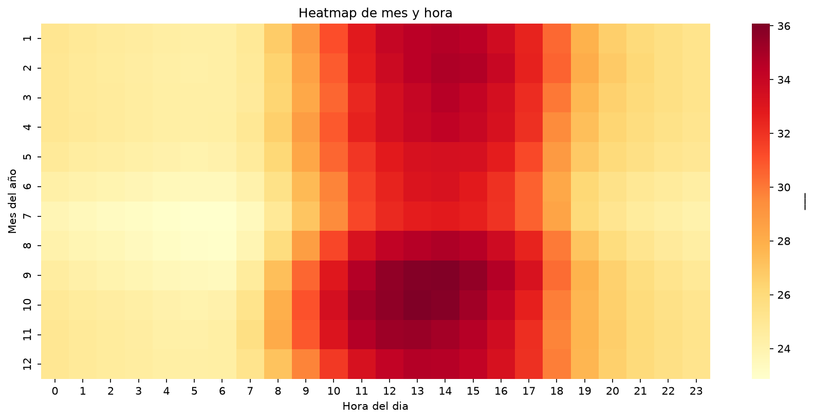
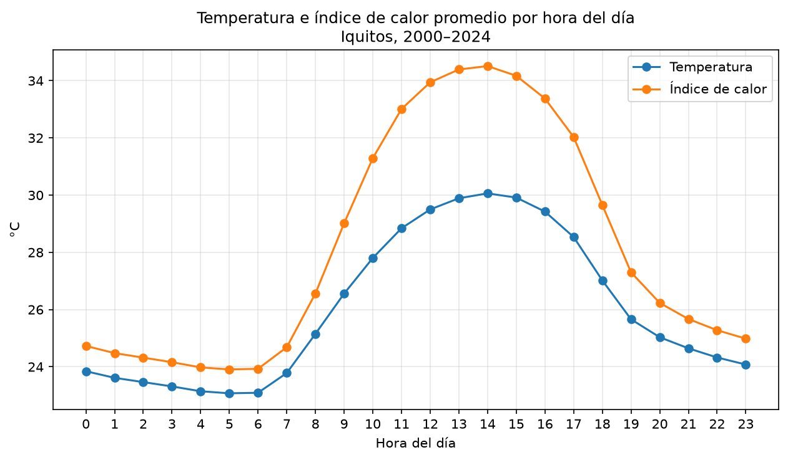
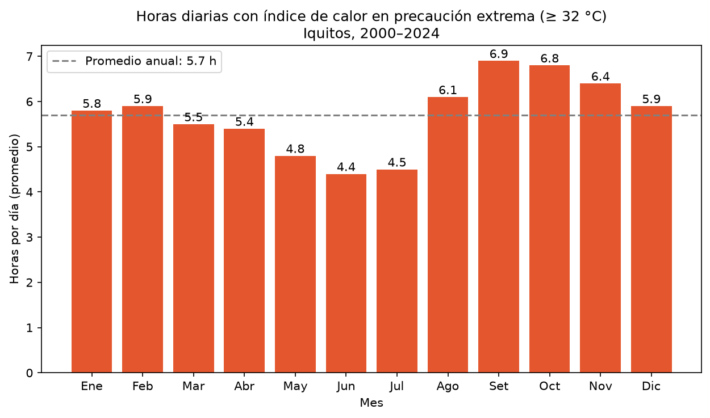

# 🌡️ Índice de calor en Iquitos (2000–2024)


Análisis de 23 años de observaciones horarias de la estación meteorológica del aeropuerto de Iquitos para identificar cuándo el calor es más intenso y anticipar la demanda de servicios de climatización.



## 🎯 Pregunta de negocio

¿En qué meses y horas el calor en Iquitos es más intenso, y cómo puede un negocio de aire acondicionado usar esa información para planificar stock, personal técnico y campañas de mantenimiento?

Se usa el **índice de calor** en lugar de la temperatura, porque combina temperatura y humedad y refleja mejor la sensación térmica en una ciudad amazónica donde la humedad relativa mediana es de **88.7%**.

## 📊 Resultados principales

1. **El calor intenso está presente casi todo el año.** Incluso en el mes más fresco hay más de **4 horas diarias** con índice de calor en *precaución extrema* (≥ 32 °C).
2. **El pico ocurre de setiembre a noviembre**, entre las 12:00 y las 15:00. Setiembre (**6.9 h/día**) y octubre (**6.8 h/día**) son los meses más críticos.
3. **Junio y julio son la única temporada más fresca**, con 4.4 y 4.5 horas diarias de precaución extrema.
4. **La humedad eleva la sensación térmica hasta 4.5 °C** por encima de la temperatura real, con la mayor diferencia a las 13:00.
5. **[COMPLETA: X horas en categoría de peligro (≥ 41 °C), concentradas en ...]**

### El día típico en Iquitos



El índice de calor alcanza su máximo alrededor de las 14:00. De madrugada, aunque la humedad está cerca del 95%, ambas curvas casi se juntan: la humedad solo intensifica la sensación de calor cuando la temperatura ya es alta.

### Horas de precaución extrema por mes



Agosto es el primer mes que supera claramente el promedio anual de 5.7 h/día: marca el inicio de la temporada de mayor calor.

## 💡 Recomendaciones

Para un negocio de climatización en Iquitos:

1. **Prepararse para la mayor demanda de setiembre a noviembre**, cuando se esperan más instalaciones y reparaciones por el uso intensivo de los equipos.
2. **Concentrar el mantenimiento preventivo en junio y julio**, la temporada de menor calor, con la meta de terminar antes de agosto.
3. **Asegurar el stock de equipos antes de agosto.** Como la mercadería llega a Iquitos por vía fluvial o aérea, los pedidos deben hacerse con anticipación según el tiempo de llegada de cada proveedor.

## 🗂️ Datos

| | |
|---|---|
| **Fuente** | [NOAA NCEI – Global Hourly (ISD)](https://www.ncei.noaa.gov/products/land-based-station/integrated-surface-database) |
| **Estación** | Aeropuerto Internacional Crnl. FAP Francisco Secada Vignetta |
| **Códigos** | ICAO: SPQT · ID NOAA: 84377099999 |
| **Periodo descargado** | 2000 – agosto de 2025 |
| **Periodo analizado** | 2000–2024 (23 años, 197,457 horas) |
| **Variables** | Temperatura y punto de rocío, observaciones horarias |

Es la única estación de la NOAA en un radio de unos 100 km alrededor de Iquitos.

## 🧹 Metodología

**Limpieza** (`01_exploracion.ipynb`)

1. Búsqueda de la estación en el catálogo de la NOAA por su código ICAO.
2. Descarga automatizada de un archivo por año.
3. Decodificación de los valores de la NOAA: vienen multiplicados por 10 y con un código de calidad (`+0275,1` equivale a 27.5 °C con calidad aceptada).
4. Eliminación de faltantes (`+9999`) y de valores con códigos de calidad sospechosos o erróneos.
5. Conversión de UTC a hora de Lima (UTC−5).
6. Evaluación de cobertura por año, considerando solo horas con temperatura y punto de rocío válidos y años bisiestos. Se incluyen los años con al menos 90% de cobertura.
7. Agregación a una fila por hora, para que los años con más reportes por hora no pesen más en los promedios.

**Variables y valores atípicos** (`02_analisis.ipynb`)

8. Cálculo de la **humedad relativa** a partir del punto de rocío con la fórmula de Magnus.
9. Cálculo del **índice de calor** con el algoritmo del Servicio Meteorológico Nacional de EE. UU. (NWS), incluido su ajuste para humedad alta.
10. Detección de **picos aislados**: valores que saltan más de 5 °C respecto a la hora anterior y a la siguiente, en la misma dirección. Se eliminaron 14 horas (0.007%), entre ellas un probable error de digitación de 33 °C a las 3:00 a. m.

**Visualización** (`03_visualizacion.ipynb`)

11. Perfil horario, heatmap de mes por hora y horas diarias por mes según las categorías de índice de calor del NWS.

### Años excluidos

| Año | Cobertura | Motivo |
|---|---|---|
| 2001 | 87.9% | Faltantes de temperatura y punto de rocío concentrados entre mayo y julio |
| 2020 | 80.1% | Probable reducción de reportes durante la pandemia |
| 2025 | 63.6% | Año incompleto (datos hasta el 24 de agosto) |

## ⚠️ Limitaciones

- La estación está en el aeropuerto, a unos 7 km del centro de la ciudad, por lo que puede no reflejar el efecto de isla de calor urbana.
- Algunas horas de 2022–2024 registran puntos de rocío de 28–29 °C, inusualmente altos. Se conservaron porque aparecen agrupados en días consecutivos y en horas lógicas, lo que sugiere un evento real y no un error.
- La detección de picos compara cada hora con la fila vecina; si falta una hora, la comparación se hace con un registro más distante.
- Los años analizados no son consecutivos. No afecta a los resultados, que son un perfil por mes y hora y no una tendencia en el tiempo.

## 📁 Estructura del proyecto

```
clima-iquitos/
├── data/
│   ├── raw/
│   │   └── iquitos_spqt_2000_2025.csv   # Datos originales de la NOAA
│   └── processed/
│       ├── iquitos_horario.csv          # Una fila por hora, datos validados
│       └── iquitos_indice_calor.csv     # Con humedad e índice de calor
├── images/                              # Gráficos del análisis
├── notebooks/
│   ├── 01_exploracion.ipynb             # Descarga, limpieza y cobertura
│   ├── 02_analisis.ipynb                # Humedad, índice de calor y picos
│   └── 03_visualizacion.ipynb           # Gráficos y conclusiones
├── requirements.txt
└── README.md
```

## ▶️ Cómo reproducirlo

```bash
git clone https://github.com/David-Sac/clima-iquitos.git
cd clima-iquitos
python -m venv .venv
.venv\Scripts\activate          # En Windows
pip install -r requirements.txt
```

Luego ejecuta los notebooks en orden: `01`, `02` y `03`. El primero descarga los datos directamente de la NOAA.

## 🔭 Próximos pasos

- Analizar si el índice de calor en Iquitos ha aumentado en las últimas décadas: las horas más calurosas del registro son de 2022 a 2024.
- Comparar los datos de esta estación con los de la estación San Roque del SENAMHI, ubicada dentro de la ciudad.

## 👤 Autor

**David Saccsara** · Data Analyst en formación · Maestría en Ciencia de Datos e IA (UTP, en curso)

[](https://www.linkedin.com/in/davidsacc/)
[](https://github.com/David-Sac)